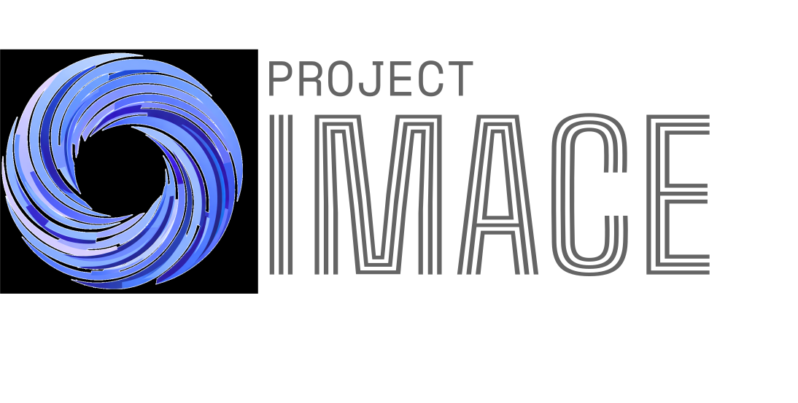

# Project IMACE  
### Integrated Modular Architecture for Cognitive Emulation

  

  
  
  
  

---

## Overview

**Project IMACE** is an **independent, open, multidisciplinary research initiative** advancing a **formal, interpretable, and modular understanding of cognition and its emulation in artificial systems**.

> Cognition is not treated as a black-box outcome, but as a **structured, decomposable, and empirically grounded system**.

---

## Core Navigation

<table>
<tr>
<td align="center" width="50%">

### 📜 Governance

<a href="https://github.com/project-imace/charter/blob/main/CHARTER.md">Charter</a> 
<a href="https://github.com/project-imace/charter/blob/main/STRUCTURE.md">Structure</a> 
<a href="https://github.com/project-imace/charter/blob/main/RESEARCH_SCOPE.md">Research Scope</a> 
<a href="https://github.com/project-imace/charter/blob/main/LICENSING.md">Licensing</a> 
<a href="https://github.com/project-imace/charter/blob/main/IP_POLICY.md">IP Policy</a>

</td>

<td align="center" width="50%">

### ⚙️ Organization

<a href="https://github.com/project-imace/.github/blob/main/CONTRIBUTING.md">Contributing</a> 
<a href="https://github.com/project-imace/.github/blob/main/CODE_OF_CONDUCT.md">Code of Conduct</a> 
<a href="https://github.com/project-imace/.github/blob/main/SECURITY.md">Security</a> 
<a href="https://github.com/project-imace/.github/blob/main/SUPPORT.md">Support</a> 
<a href="https://github.com/project-imace/.github/blob/main/ROADMAP.md">Roadmap</a>

</td>
</tr>
</table>

---

## Research System

<b>🔬 View Research Workflow</b>

### Issue System

- Research proposals  
- Experiment logs  
- Theoretical questions  
- Discussions  
- Suggestions  
- Bug reports  

### Pull Requests

- Template-based  
- Issue-linked  
- Review-structured  

### Branching

- `research/<topic>`  
- `experiment/<topic>`  
- `docs/<topic>`  
- `feat/<topic>`  
- `fix/<topic>`  
- `report/<topic>`  
- `suggestion/<topic>`  

---

## Live Project Stats

  
  

---

## Ecosystem Model

<b>🧠 View Architecture</b>

- Governance Layer → Charter Repository  
- Organization Layer → `.github`  
- Research Layer → Modular repositories  

---

## Licensing

<a href="https://github.com/project-imace/charter/blob/main/LICENSING.md">
  Repository-level licensing model (Open, Structured, Flexible)
</a>

---

## Participation

<a href="https://github.com/project-imace/.github/blob/main/CONTRIBUTING.md">Contribute</a> · 
<a href="https://github.com/project-imace/charter/blob/main/COLLABORATION.md">Collaborate</a>

---

## Sponsorship

<a href="https://github.com/project-imace/charter/blob/main/SPONSORSHIP.md">
Support Project IMACE
</a>

---

## Contact

research@imace.online  
coordinator@imace.online  
cro@imace.online  
commons@imace.online  

---

## Footer

  

© Project IMACE · Open Research Initiative

